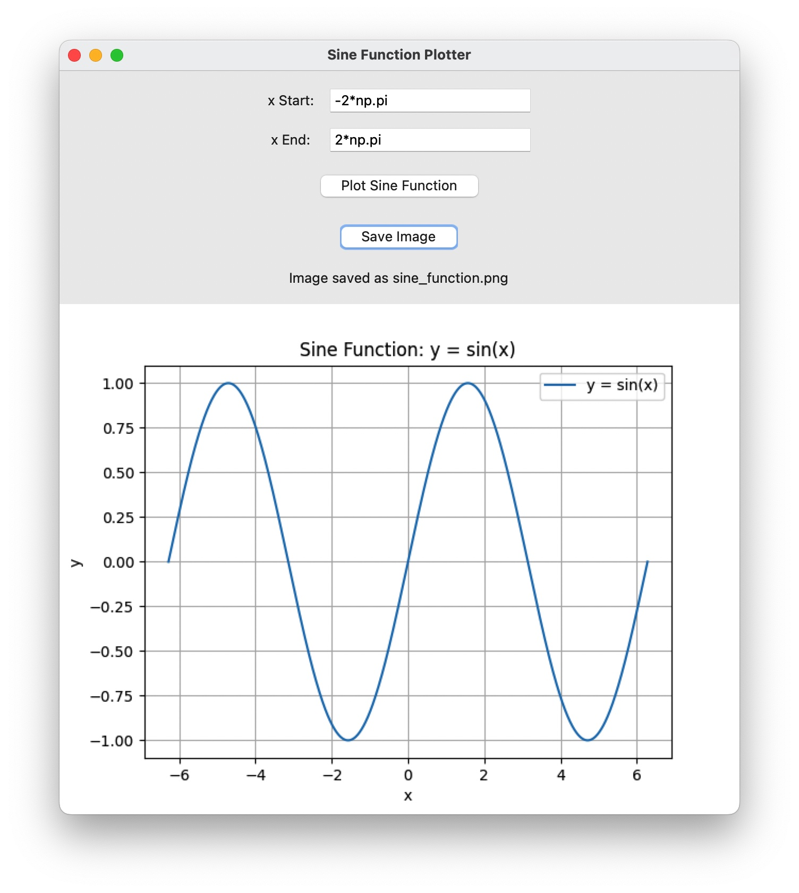
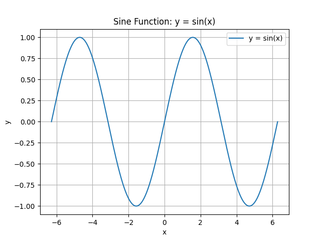

# Hello_python
零基础学编程——Python

## 项目简介
题目 2：编写程序，使用 matplotlib 库绘制一个正弦函数的图像（示例：y = sin(x)，x 取值范围为 -2π 到 2π）。 

在此基础上我为程序增加了 GUI 界面，用户可以输入 x 轴范围的起始值和结束值，并保存图像为 PNG 文件。
## 使用说明
### 运行环境
- Python3.6及以上
- numpy 库用于生成 x 值的范围
- matplotlib 库用于绘制图像
- tkinter：用于创建图形用户界面
### 操作步骤
1. 运行 main.py 文件
2. 在输入框中输入 x 轴范围的起始值和结束值，例如 -2*np.pi 和 2*np.pi
3. 点击 "Plot Sine Function" 按钮绘制图像
4. 点击 "Save Image" 按钮保存图像为 PNG 文件
5. 重新输入起始值和结束值后点击"Plot Sine Function"按钮绘制新的图像
## 运行截图

